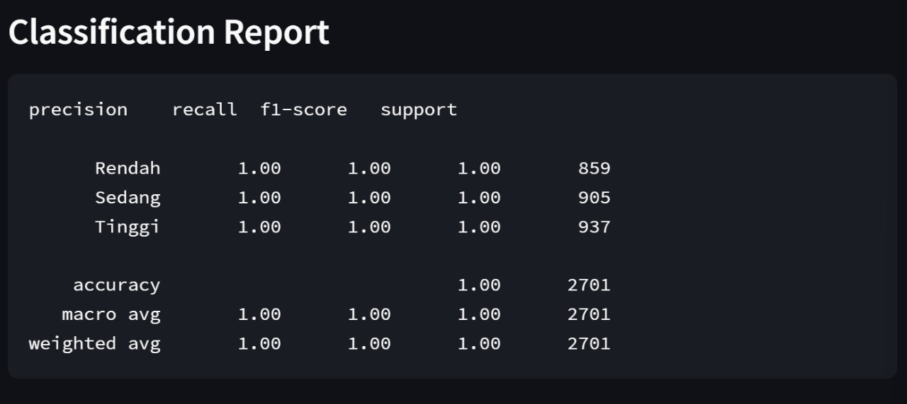
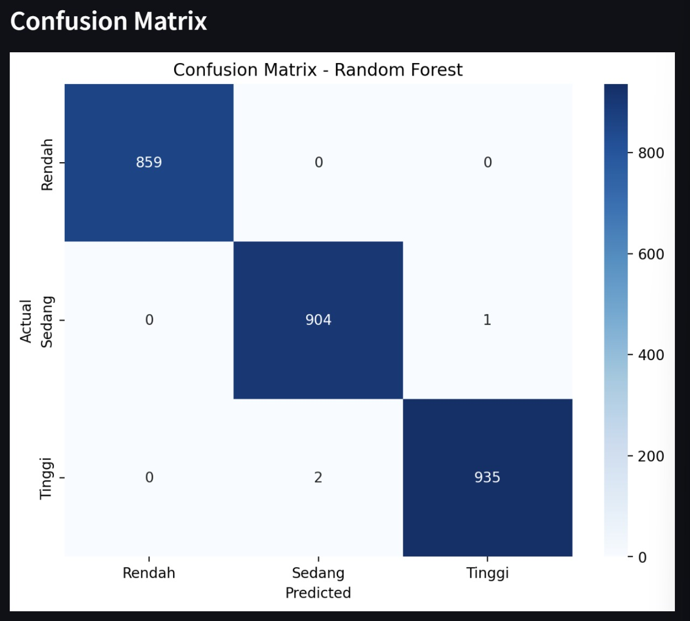
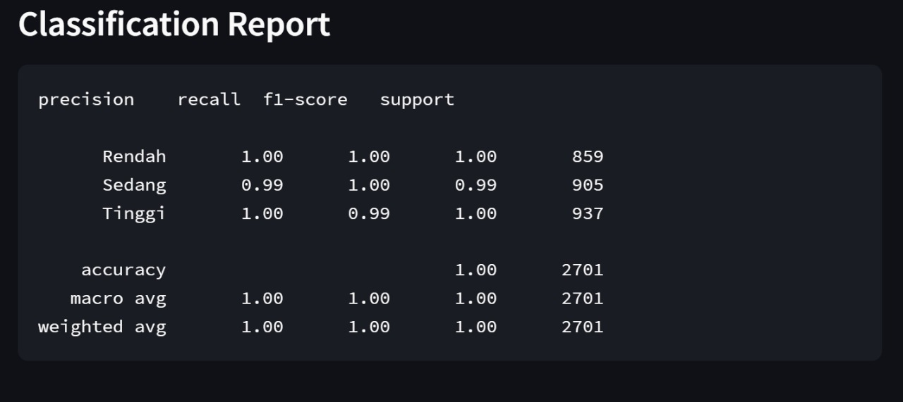
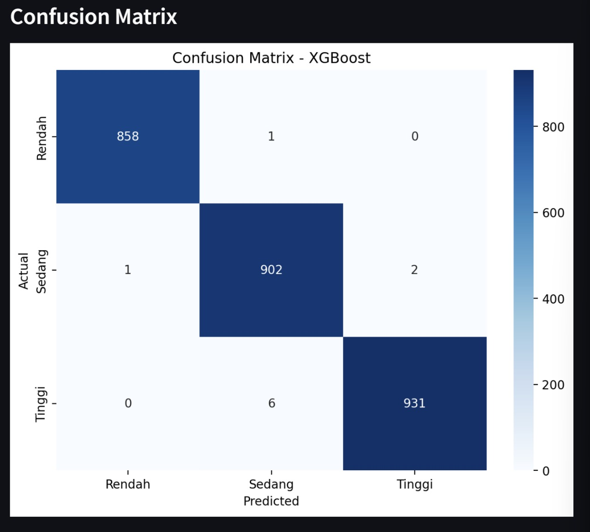
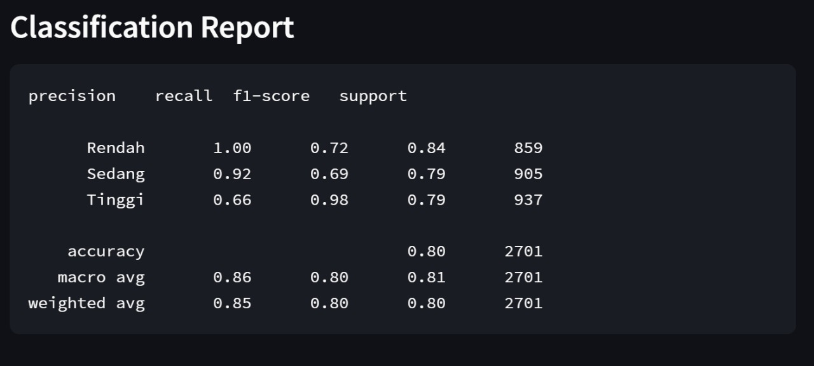
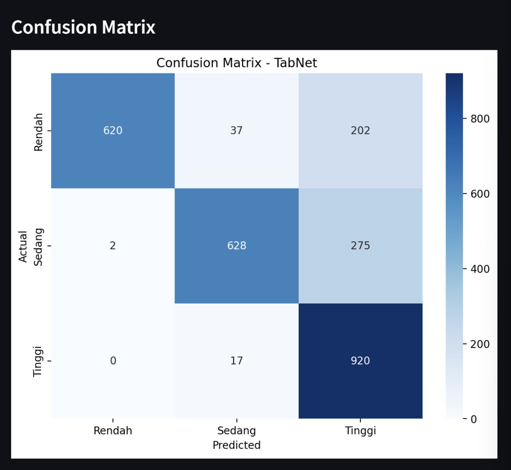

# Analisis Prediksi Berdasarkan Kategori Produksi Daging Hewan Ternak

Repositori ini berisi projek tugas akhir untuk UAP

## Overview Project

Proyek ini mempunyai tujuan utama untuk analisis prediksi kategori _"Rendah"_, _"Sedang",_ _"Tinggi"_  pada jumlah produksi daging hewan ternak.
Tidak hanya itu, proyek ini mempunyai fitur Analisis Data yang berisikan informasi statistik Deskriptif dari data seperti (Count, Mean, Std, min, dll) dan Distribusi kolom Kategori.

**Model yang digunakan :** 
1. Random Forest
2. XGBoost
3. Tabnet

##Overview Dataset

**Link Dataset yang digunakan :** [World Meat Producyion Datasets 1961-2028](https://www.kaggle.com/datasets/pragadesh06/meat-production-datasets1961-2018). Pada dataset tersebut ada beberapa file data. Oleh karena itu, pada proyek ini saya menggunakan dataset dengan nama file global-meat-production-by-livestock-type.csv

##Preprocessing dan Modelling
A) Preprocessing yang dilakukan pada semua model :
1. Pengisian nilai yang kosong dengan nilai median
2. Menambahkan kolom Total Production
3. Menambahkan Kolom Kategori _"Rendah"_, _"Sedang",_ _"Tinggi"_ (sebagai Target)
4. Pembagian kategori sama rata menggunakan qcut : 3 (_"Rendah"_, _"Sedang",_ _"Tinggi"_)

B) Modelling
1. Random Forest
   Splitting dataset 80% untuk training & 20% untuk testing
   Hasil dari Random Forest
   
   Gambar di atas merupakan _Classification Report_ dari model setelah dilakukan _predict_ terhadap _Testing Set_. Dapat dilihat bahwa akurasinya mencapai **1.00 (100%)**.
   
   Gambar diatas merupakan Confusion Matix dari model Random Forest. Dapat dilihat bahwa model dapat memprediksi semua kategori dengan hampir benar semua.

2. XgBoost
   Splitting dataset 80% untuk training & 20% untuk testing
   Hasil dari Random Forest
   
   Gambar di atas merupakan _Classification Report_ dari model setelah dilakukan _predict_ terhadap _Testing Set_. Dapat dilihat bahwa akurasinya mencapai **1.00 (100%)** dengan hasil prediksi Kategori "Sedang" **99%**.
   
   Gambar diatas merupakan Confusion Matix dari model XGBoost. Model dapat memprediksi semua kategori dengan hampir benar semua juga sama seperti Random Forest, tetapi masih lebih bagus hasil dari Random Forest. Disini model XGBoost masih kurang/salah dalam memprediksi kategori "Sedang" dan "Tinggi"

3. Tabnet
   Splitting dataset 80% untuk training & 20% untuk testing
   Hasil dari Tabnet
   
   Gambar diatas merupakan Confusion Matix dari model Tabnet. Dapat dilihat bahwa akurasinya mencapai 80% dengan hasil prediksi Kategori "Sedang" **92%** dan "Tinggi" **66%**.
   
   Gambar diatas merupakan Confusion Matix dari model Tabnet. Model dapat memprediksi semua kategori "Rendah" hampir benar semua, tetapi masih kurang/salah dalam memprediksi kategori "Sedang" dan "Tinggi"

## Link Model

Model yang digunakan dalam proyek ini dapat diakses melalui Google Drive:
[Download Model](https://drive.google.com/drive/folders/1Gdc-B5pRz4Qv_Argh-KXFc6i44yCT3HC?usp=sharing)

Silakan unduh model dari link di atas untuk menjalankan proyek ini.

## 
